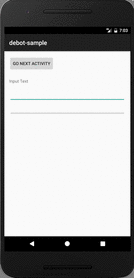
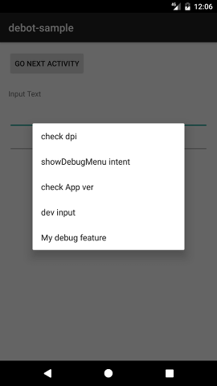
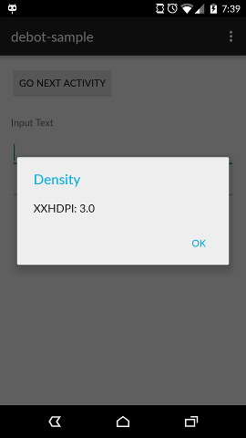
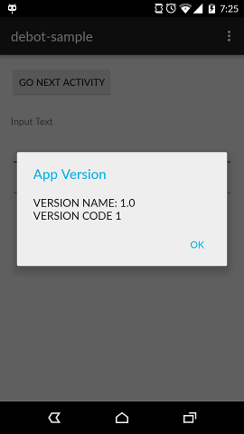
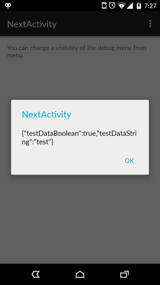
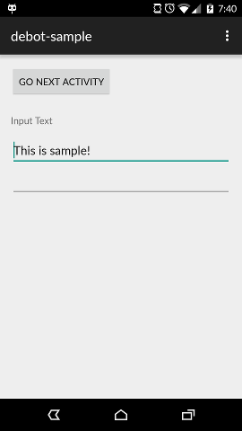

[](https://android-arsenal.com/details/1/2562)
[](https://circleci.com/gh/tomoima525/debot)
# Debot
  
A simple Android library for Debugging menu.

Debot offers a customizable debug menu for Android app development. It does not affect production code. Developers can easily add their own custom debugging features with simple steps.



## How it works
If you are using an emulator, just press `command + M`. If you are running your dev app on a real device, shake it. The debug menu dialog will show up.

## How it looks
By default, there are debug menus below.

* Default debugging menu  

* Check Density  

* Check App ver  

* Show intent and Activity Info  

* Dev input (Automatically adds text to EditText field )  



## Setup
### Download

**NOTE:**
* Debot is provided by JitPack from version 2.0.7. The groupId is changed to `com.github.tomoima525.debot` from this version.

Grab Debot from Gradle:

```kotlin
allprojects {
    repositories {
        // ...
        maven("https://jitpack.io")
    }
}

dependencies {
    debugImplementation("com.github.tomoima525.debot:debot:{latest_version}")
    releaseImplementation("com.github.tomoima525.debot:debot-no-op:{latest_version}")
}
```

Make sure you compile `debot-no-op` in the release build.

### Initialization
1. Call `DebotConfigurator.configureWithDefault()` at the Application's `onCreate()` class.

```java
public class MyApplication extends Application {
    @Override
    public void onCreate() {
        super.onCreate();
        DebotConfigurator.configureWithDefault();
    }
}
```

2. Set below to any Activity you want to show the debugging menu.

```java
public class MainActivity extends AppCompatActivity{
    Debot debot;
    @Override
    protected void onCreate(Bundle savedInstanceState) {
        super.onCreate(savedInstanceState);
        setContentView(R.layout.activity_main);
        debot = Debot.getInstance();
    }
    @Override
    public boolean onKeyUp(int keyCode, KeyEvent event) {
        if (keyCode == KeyEvent.KEYCODE_MENU) {
            debot.showDebugMenu(this);
        }
        return super.onKeyUp(keyCode, event);
    }

}    
```

It is preferred to put these code in your BaseActivity if you have one.
That's it!

If you want the debug menu on a real device, add code below.

```java
public class MainActivity extends AppCompatActivity{
    Debot debot;
    @Override
    protected void onCreate(Bundle savedInstanceState) {
        super.onCreate(savedInstanceState);
        setContentView(R.layout.activity_main);
        debot = Debot.getInstance();
        debot.allowShake(getApplicationContext()); //Make sure to use Application context, or it will leak memory
    }
    @Override
    public boolean onKeyUp(int keyCode, KeyEvent event) {
        if (keyCode == KeyEvent.KEYCODE_MENU) {
            debot.showDebugMenu(this);
        }
        return super.onKeyUp(keyCode, event);
    }

    @Override
    protected void onResume() {
        super.onResume();
        debot.startSensor(this);
    }

    @Override
    protected void onPause() {
        super.onPause();
        debot.stopSensor();
    }
}
```

See the [`debot-sample` project](debot-sample) for more details.

## Custom debugging plugins
You can create your own debugging feature by developing a class which inherits `DebotStrategy`.


```java
public class MyDebotStrategy extends DebotStrategy{
    @Override
    public void startAction(@NonNull Activity activity) {
    // Do your things
    }
}
```

Then, at the Application class, call `Debot.configureWithCustomizedMenu()`


```java
public class MyApplication extends Application {
    @Override
    public void onCreate() {
        super.onCreate();
        DebotStrategyBuilder builder = new DebotStrategyBuilder.Builder()
                .registerMenu("My debug feature", new MyDebotStrategy())
                .build();
        DebotConfigurator.configureWithCustomizedMenu(builder.getStrategyList());
    }
}
```

## Call a specific method from your Activity
If you want to call a specific method from your Activity, annotate the method with `@DebotAnnotation`

```java
//Your Activity
@DebotAnnotation("debugInput")  // A parameter for @DebotAnnotation should be same as the method's name
public void debugInput() {
    // Do things
}

```

Also, setup a custom debugging plugin with `DebotCallActivityMethodStrategy`

```java
public class MyApplication extends Application {
    @Override
    public void onCreate() {
        super.onCreate();
        DebotStrategyBuilder builder = new DebotStrategyBuilder.Builder()
                .registerMenu("input", new DebotCallActivityMethodStrategy("debugInput"))
                .build();
        DebotConfigurator.configureWithCustomizedMenu(builder.getStrategyList());
    }
}

```


## Usage with Kotlin project
You don't have to change any code with Kotlin project. However, you might see 
`kotlin-stdlib` error when you include Debot into your project. 

```
Error:Conflict with dependency 'org.jetbrains.kotlin:kotlin-stdlib' in project ':app'. Resolved versions for app (1.0.2) and test app (1.1.2-4) differ. See http://g.co/androidstudio/app-test-app-conflict for 
details.
```

In that case, you should setup `stdlib` dependency explicitly.
In your project's `build.gradle` file, add the line below:
```
 configurations.all {
     resolutionStrategy {
         force 'org.jetbrains.kotlin:kotlin-stdlib:{whatever the version of Kotlin you are using}'
     }
 }
```

See details here: https://github.com/nhaarman/mockito-kotlin/issues/146

## Avoiding Support library conflict
If you want to stick to your support library version, just exclude it from debot.

```
debugImplementation("com.tomoima.debot:debot:x.x.x") {
    exclude group: "com.android.support"
}
releaseImplementation("com.tomoima.debot:debot-no-op:x.x.x") {
    exclude group: "com.android.support"
}
```


## Credit
[seismic](https://github.com/square/seismic) - Square, Inc.

## License

```
Tomoaki Imai 2018
Licensed under the Apache License, Version 2.0 (the "License").
You may obtain a copy of the License at

http://www.apache.org/licenses/LICENSE-2.0

Unless required by applicable law or agreed to in writing, software distributed
under the License is distributed on an "AS IS" BASIS, WITHOUT WARRANTIES
OR CONDITIONS OF ANY KIND, either express or implied. See the License for
the specific language governing permissions and limitations under the License.

You agree that all contributions to this repository, in the form of fixes, 
pull-requests, new examples etc. follow the above-mentioned license.
```
